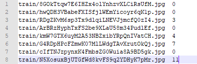

Demonstrate image classification with paddlepaddle framework

## Motivation
PaddlePaddle dynamic graph is easy to use, and quite similar with pytorch. Meanwhile, [Ai studio](https://ai.baidu.com/) supplys free GPU hours(Tesla V100,Tesla V100*4, and Tesla V100*8) for developpers who interest in learn AI for fun, or need powerful GPUs for AI competitions. I try to learn it and prepare for some others task for fun in my spare time. This is an example of the workflow on doing image classification task with paddlepaddle, and code what I used to classify the class of a cat from image.

## Pre-requisites
1. paddle 1.8
2. numpy
3. matplotlib
4. pandas
5. cats dataset

## Installation
1. install packages
   ```
   pip install -r requirements.txt -i https://pypi.tuna.tsinghua.edu.cn/simple
   ```
   or 
   ```
   pip install -r requirements.txt
   ```

2. download cats dataset
   ```
   链接：https://pan.baidu.com/s/1cE3AbX1UzDsbeD2pTbFSPw 
   提取码：i29d 
   ```

## How to use it

```
python train_predict.py
```

## Customized it for other application
1. organize dataset in following format
```
├── dataset
   └── YOUR_DATASET_NAME
       ├── train
           ├── xxx.jpg (name, format doesn't matter)
           ├── yyy.png
           └── ...
       ├── test
           ├── zzz.jpg
           ├── www.png
           └── ...
       └── train_list.txt
```
2. format train_list.txt in following format
   
   

3. configure dataset

   update variable 'DATASET' in dataset.py
   ```
   DATASET = YOUR_DATASET_NAME
   ```
## Lesson learned

1. Comparing with tensorflow, it is quite convinent to integrate three party python packages with paddle framework.
2. Sometimes, cv2.imread() may not work, try PIL.Image instead.
3. paddlex.cls.transforms can be used for image augmentation, but albumentation is better.
4. pandas do a better job than numpy when saving data to file.
5. Model, Optimizer, and batch_size should be tweaked when loss can not be optimized from the begining.
6. Excessive augmentation could lead loss exposure in the begining, and bigger batch_size could help with this problem.
7. Normalization image to [0,1], when relu activation is used.
8. The purpose of Augmentation is to create more images with realistic varant but keep invarant features.